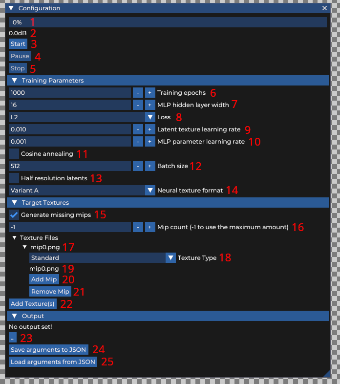
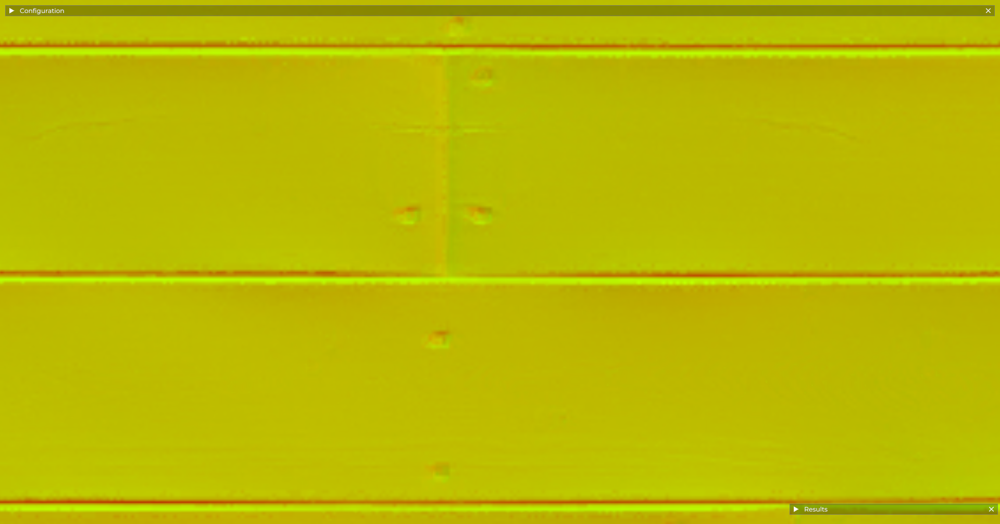
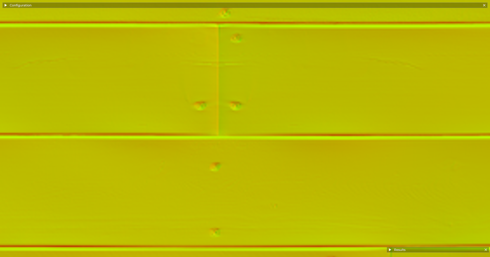
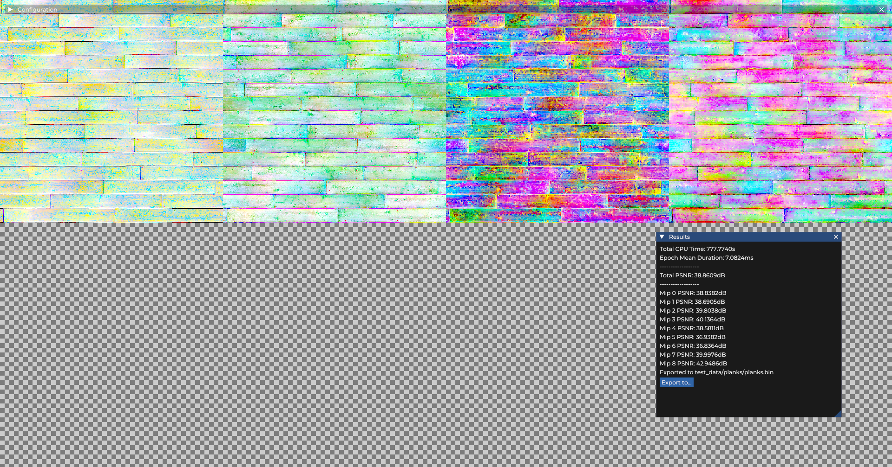

# NT-BCf

Neural texture compression with block compressed features. A FOSS implementation of [Intel's texture set neural compression](https://arxiv.org/abs/2506.06040).

Please note that this project is in no way affiliated to or endorsed by Intel. It's just something I decided to make when I couldn't find any reference implementation.

## Usage

The encoder currently supports PNG, JPEG, Webp, BMP, AVIF, OpenEXR (partial), and HDR texture formats.

### CLI

The commands below all use the SlangPy implementation, but the PyTorch implementation accepts all the same arguments.

```shell
# Start encoding without a GUI
python encoder-slangpy.py --no-gui ...

# Use a predefined JSON file
python encoder-slangpy.py -j test_data/planks/planks.json

# Overriding parameters from the JSON file
python encoder-slangpy.py -j test_data/planks/planks.json -e 10k

# Specify standard target textures via the command line
python encoder-slangpy.py -i test_data/planks/planks-color.png ...

# Normal map texture...
python encoder-slangpy.py -n test_data/planks/planks-normal.png ...

# Single channel texture...
python encoder-slangpy.py -s test_data/planks/planks-ao.png ...

# Use an artist created mip chain
python encoder-slangpy.py -i test_data/mip_tests/mip0.png,test_data/mip_tests/mip1.png,test_data/mip_tests/mip2.png ...
```

A comprehensive list of command line arguments can be obtained with the `-h/--help` command line argument.

### GUI

Please note that this section only applies to the SlangPy encoder. The PyTorch encoder doesn't have a GUI outside of matplotlib.

The encoder GUI is started up automatically when running `python encoder-slangpy.py`.

#### Configuration



1. **Progress Bar**: Shows the percentage completion.

2. **PSNR**: The last reported PSNR value by the encoder. Note that this is often higher than the actual PSNR value for the neural texture.

3. **Start Button**: Starts encoding with the current configuration.

4. **Pause Button**: Pauses encoding until encoding is resumed or stopped completely. Note that the configuration of the encoder **can not** be changed while paused.

5. **Stop Button**: Stops encoding completely.

6. **Training Epochs**: The number of epochs the texture should be trained for.

7. **MLP Hidden Layer Width**: The number of neurons that should be in the hidden layer of the decoder MLP. Some common values are 16, 32, and 64.

8. **Loss**: The loss metric that should be reduced. Options are L1 and L2 (default)

9. **Latent Texture Learning Rate**: The learning rate for the latent BC1 texture.

10. **MLP Parameter Learning Rate**: The learning rate for the MLP weights and biases.

11. **Cosine Annealing**: Uses a cosine annealing learning rate scheduler. Cosine annealing can help convergence a little bit for longer training session.

12. **Batch Size**: The X and Y dimensions of the sampling grid used during training. Larger values result in slower, but more stable training.

13. **Half Resolution Latents**: Makes the largest latent BC1 textures are at half the resolution of the target texture.

14. **Neural Texture Format**: Specifies which variant of latent features should be used. Under the hood, this controls the resolutions of the four latent BC1 textures.
    
    1. Variant A: Higher quality, but more storage. \~1.25 bpp
    
    2. Variant B: More storage, but lower quality. \~0.66 bpp

15. **Generate Missing Mips**: Fills in missing mips in a target mip chain. This only adds mips to the end of a chain, and wont fill in any gaps between mips.

16. **Maximum Mips**: Specifies the amount of mips needed in a chain. A value of -1 means that the mip chain should be complete, all the way down to 4x4 resolution.

17. **Target Texture**: A target texture mip chain. Contains all locations and information on the texture.

18. **Texture Type**: Specifies the type of texture that this is. This controls how many channels from the image file are used.
    
    1. Standard: All channels of the texture are used.
    2. Normal Map: Only the first two channels are used. The third channel can be easily reconstructed at runtime.
    3. Single Channel: Only the first channel is used.

19. **Mip Label**: The file name of a mip in the chain.

20. **Add Mip Button**: Adds the next mip in the chain.

21. **Remove Mip Button**: Removes the smallest mip from the chain. Removes the texture if there is only one mip remaining.

22. **Add Texture Button**: Add a file or files to the target texture list. If you have an artist created mip chain, then you should select the largest mip from the chain.

23. **Output File Button:** Select the output location for the exported neural texture at the end of training.

24. **Save Arguments to JSON Button**: Saves the current configuration to a JSON file.

25. **Load Arguments from JSON Button**: Loads the configuration stored in a JSON file.

#### Keybindings

- **1**: Show L1 error per texture

- **2**: Show L2 error per texture

- **i**: Show input textures

- **o**: Show output/reconstructed textures

- **L**: Show latent textures

- **Up**: View the next largest mip level

- **Down**: View the next smallest mip level

### Differences between SlangPy and PyTorch Implementations

The most notable differences between the encoders are:

- **GUI**: The PyTorch encoder and decoder lacks a polished GUI, unlike the SlangPy implementations. The PyTorch implementations 'GUI' simply displays the largest mip of the input, output, and latent textures using matplotlib.

- **Memory Usage**: The SlangPy encoder uses less memory compared to the PyTorch encoder. For example, a 1k texture set (full mip chain, 9 channels total) uses \~390MB with SlangPy, while PyTorch uses \~710MB.

- **Performance Scaling**: The PyTorch encoder will take significantly longer per epoch on larger textures than on smaller textures. For example, on my system the SlangPy encoder will take \~7ms per epoch on a 1k and 2k texture set, and \~11ms on a 4k texture set. The PyTorch encoder however will take \~9ms, \~24ms, and \~84ms on those same texture sets.

- **Bicubic Interpolation**: The PyTorch and SlangPy use different variants of bicubic interpolation for sampling the target textures. SlangPy uses Catmull-Rom, and PyTorch uses a variant similar to OpenCV. The latter allegedly produces a sharper result, so I may replace SlangPy's cubic interpolation in the future.

I would generally recommend the SlangPy encoder when it's available due to the performance differences. I believe that both encoders can converge to similar quality results, but it's difficult to tell with randomized initialization of texture, weights, and biases (to say nothing of the random nature of stochastic gradient descent).

> ### Note on SlangPy hardware requirements/support
> 
> The SlangPy encoder requires a GPU that supports Vulkan and the VK\_EXT\_shader\_atomic\_float extension (on top of any other extensions that SlangPy requires by default).
> 
> My own testing hardware has been limited to Nvidia GPUs on Linux. As such, I can't offer any guarantees on how well the SlangPy encoder will function on other vendor's hardware, or on other OSes. Please help give a clearer picture of what environments the SlangPy encoder is supported in by submitting a hardware report (see [below](#Hardware Report)).

## Example Results

These screenshots are taken from the planks test data, after 100k epochs and using cosine annealing and the BCf1A variant.

**Reconstructed texture**:



**Target texture**:



**Latent textures**:



## Contributing

### Hardware Reports

Hardware reports are the easiest way to contribute. So far I've only been able to test the SlangPy implementation using the what hardware is available to me. A clearer picture of the situations it is and isn't supported in would be very helpful to other users and myself.

Submit your reports as comments under [this issue](https://github.com/RGDTAB/NT-BCf/issues/1). The only things you need to include are your GPU model, OS, driver version, and the cumulative PSNR after 10k epochs of training using the planks texture set.

### Bug Reports

Bug reports are more than welcome! Please remember to include your GPU model, OS, driver version, and any other key information you can think of.

### Pull requests

Pull requests are also welcome. Before working on a PR implementing a new feature, please open a feature request first so we can discuss it first.
